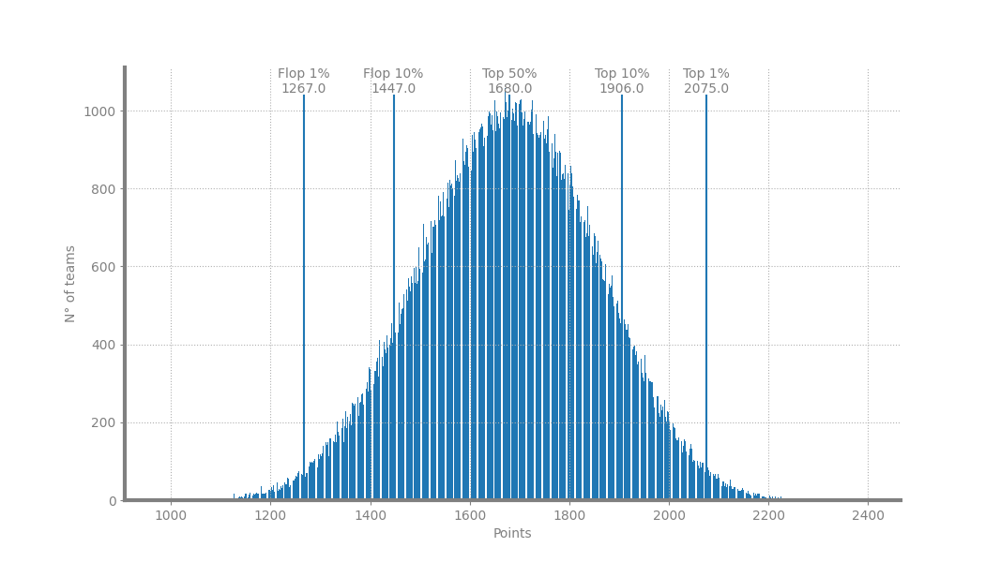

# FantaSanReport 2024
## General Stats
* Total teams <= 100 baudi: 90503
* Total teams <= 100 baudi with captain: 452515

## Top 10 teams
1. LaSad, DargenDAmico, **AngelinaMango**, IlTre, BigMama
 Value: 98
 Points: 2395

2. LaSad, DargenDAmico, **AngelinaMango**, IlTre, bnkr44
 Value: 97
 Points: 2340

3. LaSad, DargenDAmico, **AngelinaMango**, BigMama, bnkr44
 Value: 97
 Points: 2339

4. LaSad, DargenDAmico, IlTre, BigMama, **IlVolo**
 Value: 95
 Points: 2326

5. LaSad, **AngelinaMango**, IlTre, BigMama, Emma
 Value: 99
 Points: 2324

6. LaSad, **AngelinaMango**, IlTre, BigMama, IlVolo
 Value: 96
 Points: 2318

7. LaSad, **AngelinaMango**, IlTre, BigMama, Negramaro
 Value: 98
 Points: 2317

8. LaSad, DargenDAmico, **AngelinaMango**, IlTre, Maninni
 Value: 98
 Points: 2314

9. LaSad, DargenDAmico, **AngelinaMango**, BigMama, Maninni
 Value: 98
 Points: 2313

10. LaSad, DargenDAmico, AngelinaMango, **IlTre**, BigMama
 Value: 98
 Points: 2312

## Flop 10 teams
1. FiorellaMannoia, Gazzelle, Irama, AlessandraAmoroso, **Clara**
 Value: 97
 Points: 979

2. Mahmood, Gazzelle, Irama, AlessandraAmoroso, **Clara**
 Value: 98
 Points: 988

3. SantiFrancesi, Gazzelle, Irama, AlessandraAmoroso, **Clara**
 Value: 93
 Points: 998

4. FredDePalma, Gazzelle, Irama, AlessandraAmoroso, **Clara**
 Value: 95
 Points: 1009

5. FiorellaMannoia, Gazzelle, Irama, **AlessandraAmoroso**, Clara
 Value: 97
 Points: 1011

6. Geolier, Gazzelle, Irama, AlessandraAmoroso, **Clara**
 Value: 99
 Points: 1019

7. Mahmood, Gazzelle, Irama, **AlessandraAmoroso**, Clara
 Value: 98
 Points: 1020

8. RoseVillain, Gazzelle, Irama, AlessandraAmoroso, **Clara**
 Value: 96
 Points: 1028

9. SantiFrancesi, Gazzelle, Irama, **AlessandraAmoroso**, Clara
 Value: 93
 Points: 1030

10. RicchiEPoveri, Gazzelle, Irama, AlessandraAmoroso, **Clara**
 Value: 95
 Points: 1032

## Score distribution

